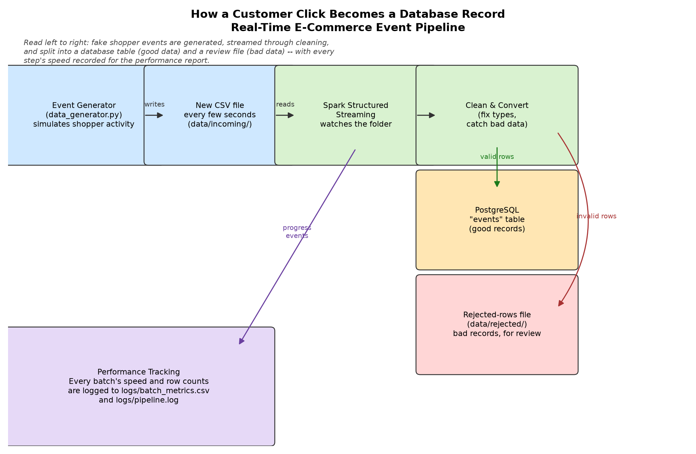

# Real-Time E-Commerce Event Pipeline

A demonstration streaming pipeline that simulates shopper activity on an
e-commerce site -- views, cart-adds, purchases -- and moves each event from
generation to a queryable PostgreSQL table within seconds, cleaning and
validating it along the way.

It's built to answer "what is happening right now" instead of "what happened
yesterday": the kind of question that matters for catching a broken checkout
flow, a fraud spike, or a sudden shift in what's selling while it's still
actionable. The "shoppers" are simulated by a script rather than real
traffic, but the ingestion, validation, and storage components work exactly
as they would in production.

## Architecture



1. **Event generator** (`data_generator.py`) -- every few seconds, writes a
   new CSV of fake events to `data/incoming/`. A small fraction of events
   are deliberately made invalid (negative price, bad timestamp, unknown
   event type, etc.) to prove the next stage actually catches bad data.
2. **Spark Structured Streaming job** (`spark_streaming_to_postgres.py`) --
   watches `data/incoming/` for new files. For every micro-batch it:
   - reads the raw CSV and casts fields to their proper types,
   - flags any row that fails a data-quality rule and records *why*,
   - writes valid rows to PostgreSQL and invalid rows to
     `data/rejected/` (nothing is silently dropped),
   - logs row counts and timing for the batch.
3. **PostgreSQL** -- stores every valid event in a single `events` table
   (created by `postgres_setup.sql`), ready for ad hoc queries or a
   dashboard.

See [project_overview.md](project_overview.md) for a more detailed walkthrough.

## Project layout

```
data_generator.py                  entry point: generates fake events
spark_streaming_to_postgres.py     entry point: streams events into Postgres
src/streaming_pipeline/
  config.py                        paths, generator settings, connection info
  events.py                        pure functions that generate fake events
  generator_io.py                  atomic CSV writes into data/incoming/
  schema.py                        Spark schema for the raw event CSVs
  transform.py                     type conversion + validation (clean_events)
  sink.py                          foreachBatch sink: Postgres or rejected/
  db.py                            PostgreSQL connection + batch insert
  metrics.py                       StreamingQueryListener -> logs/batch_metrics.csv
  spark_utils.py                   SparkSession construction
  logger_config.py                 centralized logging setup
postgres_setup.sql                 creates the role, database, and events table
data/incoming/                     generated event CSVs (watched by Spark)
data/rejected/                     rows that failed validation, with the reason
checkpoints/                       Spark Structured Streaming checkpoint state
logs/                              pipeline.log, batch_metrics.csv, batch_row_counts.csv
reports/plots/                     throughput/latency charts used in performance_metrics.md
tests/                             pytest unit tests (+ a DB test, skipped if unreachable)
```

## Prerequisites

- Python 3.12 (PySpark 3.5 is not yet compatible with newer Python releases)
- Java 8 or 11 (required by Spark)
- PostgreSQL 14+, running locally or reachable over the network

## Setup

```bash
python3.12 -m venv .venv
source .venv/bin/activate
pip install -r requirements.txt
```

Set up PostgreSQL once, as a superuser:

```bash
psql -h localhost -p 5432 -U postgres -f postgres_setup.sql
psql -h localhost -p 5432 -U postgres -c "ALTER ROLE streaming_app WITH PASSWORD 'choose-a-password';"
cp .env.example .env
# edit .env and set POSTGRES_PASSWORD to the password you just chose
```

This creates the `streaming_app` role, the `streaming_events` database, and
the `events` table.

## Running the pipeline

Run these in two separate terminals -- start the generator first so there's
data to stream.

**Terminal 1 -- generate events continuously:**
```bash
python data_generator.py
```
Flags: `--num-files N` (stop after N files), `--events-per-file N` (default
50), `--interval SECONDS` (default 5), `--seed N` (reproducible output).

**Terminal 2 -- stream events into Postgres:**
```bash
python spark_streaming_to_postgres.py
```
Flags: `--once` (drain every file currently in `data/incoming/`, then exit),
`--duration SECONDS` (run continuously, then stop automatically).

## Checking the results

```bash
psql -h localhost -p 5432 -U streaming_app -d streaming_events \
  -c "SELECT event_type, count(*) FROM events GROUP BY event_type;"
```

- `logs/pipeline.log` -- full activity log
- `logs/batch_metrics.csv` -- per-batch row counts and timing
- `data/rejected/rejected_batch_<id>.csv` -- rejected rows, with the reason
  in the `validation_reason` column

See [performance_metrics.md](performance_metrics.md) for throughput/latency
numbers from a real run.

## Testing and linting

```bash
pytest -q        # tests/test_db.py is skipped automatically if Postgres is unreachable
ruff check .
```

## Documentation

- [project_overview.md](project_overview.md) -- what the pipeline does and why
- [user_guide.md](user_guide.md) -- detailed setup and run instructions
- [test_cases.md](test_cases.md) -- manual test plan and results
- [performance_metrics.md](performance_metrics.md) -- throughput/latency from a real run
- [postgres_connection_details.txt](postgres_connection_details.txt) -- why credentials live in `.env`
