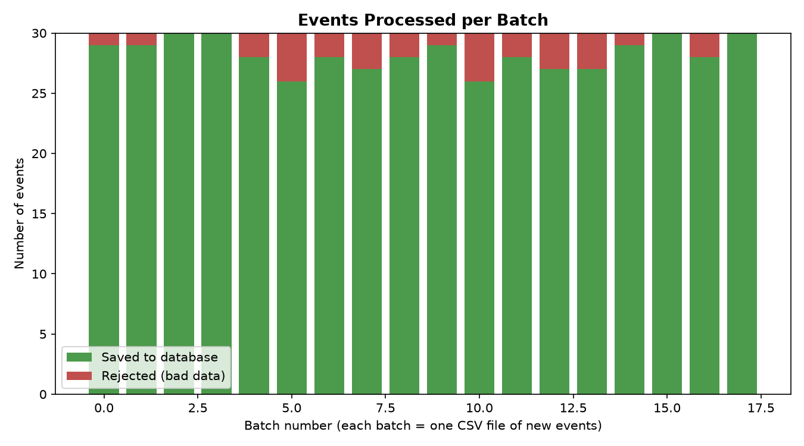
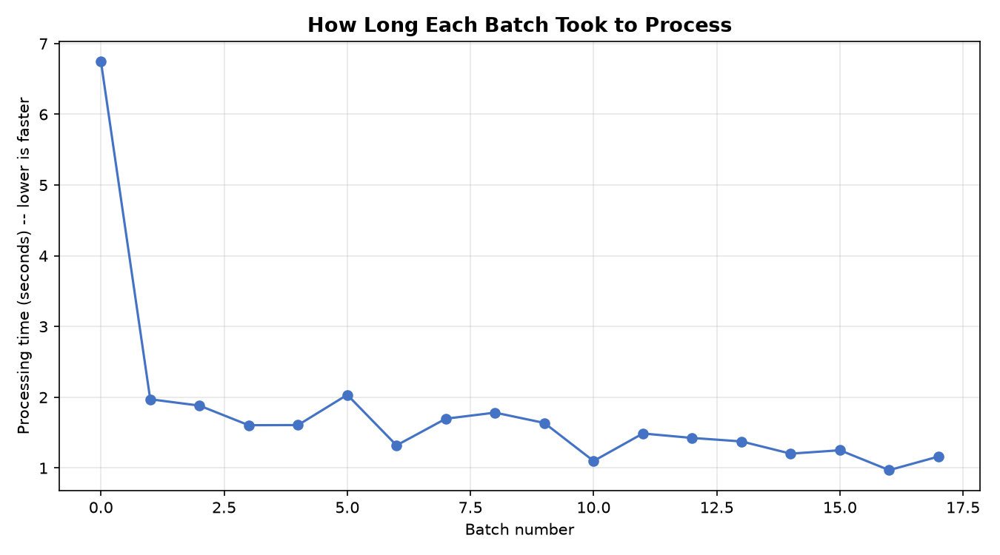

# Performance Metrics

*Measured from a real local run of the pipeline -- not estimated.*

## Summary (plain-language)

- **540 events** arrived across **18 batches** (each batch = one new CSV file).
- **509 events (94%)** passed data-quality checks and were saved to PostgreSQL.
- **31 events (6%)** were rejected for bad data and saved to `data/rejected/` for review.
- After the first (one-time, colder-start) batch, a typical batch took **1.50 seconds** to process
  (fastest: 0.97s, slowest: 2.04s).
- Once warmed up, the pipeline processed about **21.6 events per second**.

## Why some events were rejected

The event generator deliberately injects a small fraction of bad data (about 5%) to prove the
pipeline actually catches it instead of silently accepting garbage. Breakdown for this run:

| Reason | Count |
|---|---|
| invalid_event_time | 4 |
| invalid_event_type | 11 |
| invalid_price | 6 |
| invalid_quantity | 6 |
| missing_product_id | 4 |

Every rejected row is kept, not deleted -- see the CSV files under `data/rejected/` for the exact rows and reasons.

## Charts

## Per-batch detail

| Batch | Received | Inserted | Rejected | Processing time |
|---|---|---|---|---|
| 0 | 30 | 29 | 1 | 6.75s |
| 1 | 30 | 29 | 1 | 1.97s |
| 2 | 30 | 30 | 0 | 1.88s |
| 3 | 30 | 30 | 0 | 1.60s |
| 4 | 30 | 28 | 2 | 1.61s |
| 5 | 30 | 26 | 4 | 2.04s |
| 6 | 30 | 28 | 2 | 1.32s |
| 7 | 30 | 27 | 3 | 1.70s |
| 8 | 30 | 28 | 2 | 1.78s |
| 9 | 30 | 29 | 1 | 1.64s |
| 10 | 30 | 26 | 4 | 1.10s |
| 11 | 30 | 28 | 2 | 1.49s |
| 12 | 30 | 27 | 3 | 1.43s |
| 13 | 30 | 27 | 3 | 1.38s |
| 14 | 30 | 29 | 1 | 1.20s |
| 15 | 30 | 30 | 0 | 1.25s |
| 16 | 30 | 28 | 2 | 0.97s |
| 17 | 30 | 30 | 0 | 1.16s |

## How this was measured

- **Setup:** a single local machine (Spark `local[*]`, one PostgreSQL instance), not a distributed cluster.
  Absolute throughput numbers would differ on production-scale hardware; the relative behavior
  (near-constant per-batch latency, low rejection rate) is what matters here.
- **Batch size:** 30 events per file, one file read per micro-batch (`maxFilesPerTrigger=1`),
  new files arriving roughly every 3 seconds against a 5-second trigger interval.
- **Batch duration** comes from Spark's own `StreamingQueryListener` progress events
  (`logs/batch_metrics.csv`). **Received/inserted/rejected counts** come from the sink itself
  (`logs/batch_row_counts.csv`), which is the authoritative source -- Spark's self-reported
  `numInputRows` was observed to run 1 row high per batch (a cosmetic quirk in Spark's own
  instrumentation), so it is not used for the row-count figures above.
- Because the demo generator stops after a fixed number of files while the stream keeps its
  steady trigger interval, a few generated files can still be waiting in `data/incoming/` when
  the demo window ends -- that's expected for a timed demo, not data loss (nothing is deleted
  from `data/incoming/`, so a subsequent run picks them up).
